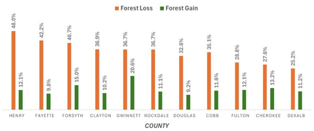
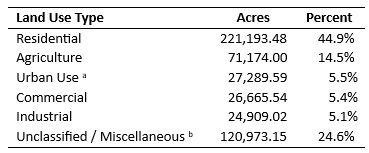

# Atlanta-Urban-Sprawl-Change-Detection

---

**Author:** Dustin Littlefield

**Project Type:** Remote Sensing & Urban Classification

**Tags:** `Wildfire Analysis` `Remote Sensing` `ArcGIS Pro` `Landsat` `Change Detection` `Unsupervised Classification` `Hot Spot Analysis`

---
## Overview
Thie project maps and characterizes the extent of urban expansion in the Atlanta Metropolis Region from 1999 to 2021 using Landsat imagery and unsupervised classification. Change detection and hot spot analysis are used to identify trends in spatial patterns.

The analysis reveals strong outward expansion into suburban counties, fragmentation of green space, and development patterns closely aligned with major transportation corridors.

<figure>
  <figcaption style="font-size:0.9em; margin-bottom:8px;">
    <strong>Figure 1.</strong> Hot spot analysis of developed forest land conducted with Getis Gi* algorithm. Red hot spots represent statistically significant areas where forest loss is clustered, while blue spots represent areas with low levels of conversion. Highways are overlaid to illustrate spatial relationship between roadways and development. 
    <em> Map Author: Dustin Littlefield PCS: WGS 1984 UTM Zone 16N Source: U.S. Geological Survey Landsat 8 Imagery. </em>
  </figcaption>
  
  </figure>

## Data

**Data Source**
- 1999: Landsat 7 ETM+ Level‑2 Surface Reflectance
    - Path 19/Row 36 (Sept 10, 1999)
    - Path 19/Row 37 (Sept 28, 1999)
- 2021: Landsat 8 OLI/TIRS Level‑2 Surface Reflectance
    - Path 19/Row 36 (July 28, 2021)
    - Path 19/Row 37 (July 28, 2021)

**Ancillary Data**
- NLCD 2011 (modified) — used for color schema
- LandPro2009 land‑use dataset (Atlanta Regional Commission) — used to interpret development types

## Methodology
1. Unsupervised Classification (ISO Cluster)
    - Parameters: Iterations (5), Clusters (10), Skip Factor (1)
    - Classes manually interpreted into “Developed” vs “Forested” categories
    - Performed on 1999 and 2021 sattelite mosaics
2. Change Detection
    - Parameters:
        - Categorical change method
        - Changed filter only 
        - To color (emphasize final state of land cover)
3. Spatial Analysis
    - County‑level summaries of forest loss
    - Hot Spot Analysis (Getis‑Ord Gi*) to identify statistically significant clusters of development
    - Overlay with highways to interpret commuter‑driven expansion patterns

## Results
- Detected 34% of forest lands transitioned to developed from 1999 to 2021
- Growth is concentrated in peripheral counties such as Henry, Fayette, and Forsyth.

<figure>
  <figcaption style="font-size:0.9em; margin-bottom:8px;">
    <strong>Figure 2.</strong> Urbanization and reforestation rates throughout the Counties of Atlanta Greater Metropolis Area. Percentage represents ratio of developed forest land in a county to total land classified in the county. 
  </figcaption>
  
</figure>

- Hot spots of development align with major highways (I‑75, I‑85, GA‑19).
- Pattern of development indicates massive residential expansion with municipal and commercial development following.
 
<figure>
  <figcaption style="font-size:0.9em; margin-bottom:8px;">
    <strong>Table 1.</strong> Land‑use composition (based on 2009 LandPro data) of areas that transitioned from forest to developed land between 1999 and 2021 in the Greater Atlanta metropolitan region. 
  </figcaption>
  
</figure>

<figure>
<figcaption style="font-size:0.9em; margin-bottom:6px;">
<strong>Note:</strong> Land‑use categories reflect 2009 conditions, the midpoint of the change‑detection period. Areas that remained forested after 2009 are grouped into the Unclassified category. 
a Includes cemeteries, parks, reservoirs, and transportation. 
b Includes transitional or unclassified land and possible misclassification due to 30‑m Landsat resolution.
</figure>