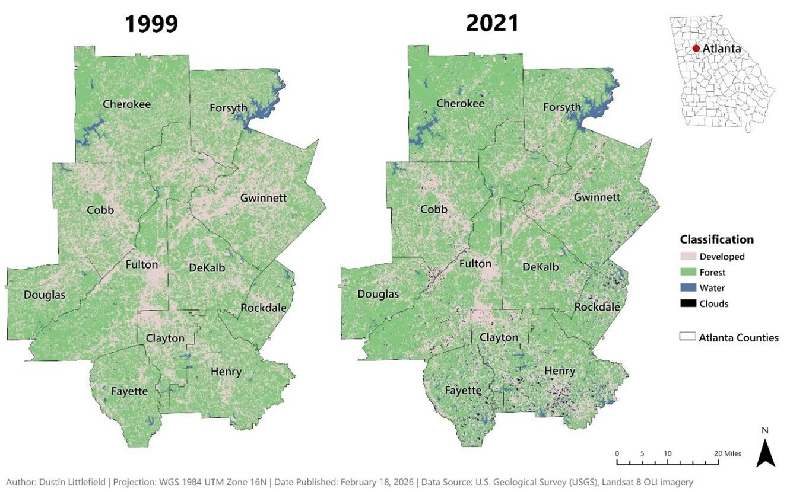
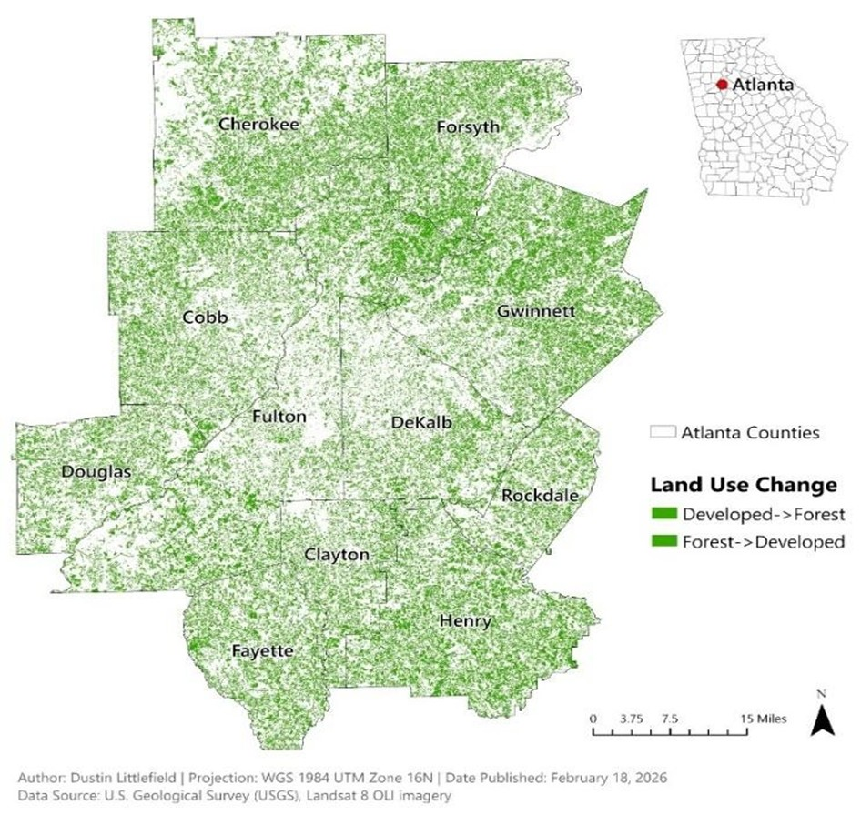
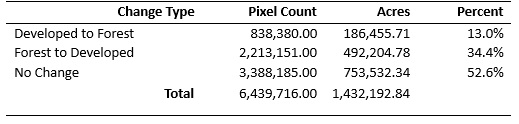
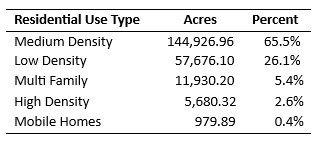
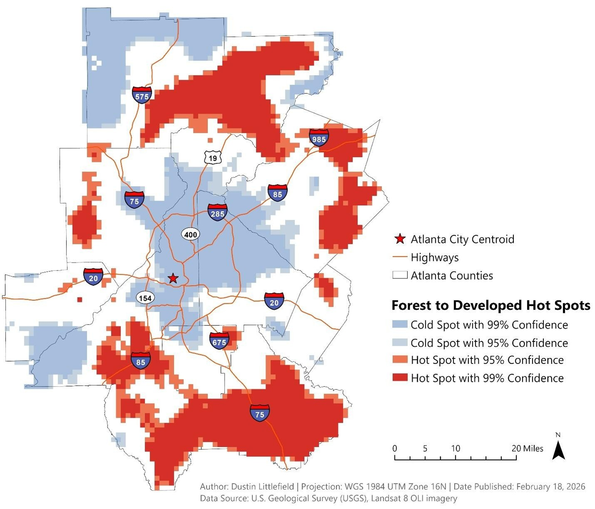

# Atlanta-Urban-Sprawl-Change-Detection
 

**Author:** Dustin Littlefield  
**Portfolio:** https://github.com/dustinlit  
**Project Type:** `Remote Sensing` `Urban Classification` `Change Detection`  
**Technologies:** `ArcGIS Pro` `Landsat` `Unsupervised Classification` `Change Detection` `Hot Spot Analysis`  
**Last Updated:** March 2026

## Introduction 
Urban Sprawl is the general term used to describe the outward expansion of development surrounding a metropolis area. This spread is usually driven by workers in the city who desire lower density suburban housing. Many large urban areas around the globe struggle to maintain the balance between outward growth and protection of the surrounding natural ecosystems. Unchecked expansion can have negative effects on ecological and public health of a region by the significant reduction of surrounding green spaces (Lopez-Aparicio, 2025).  

According to the 1970 census tracts preserved by the Atlanta Regional Commission, the greater Atlanta metropolis primarily consisted of five core counties: Clayton, Cobb, DeKalb, Fulton, and Gwinnett (Atlanta Regional Commission, 1970). Presently, the cities influence has expanded to thirteen counties and is still actively growing. This spread has cost significant forest deforestation and fragmentation throughout the counties negatively affecting diversity of tree species, wildlife habitats and corridors, and surrounding wetlands (Miller, 2012). This growth may be due to the favoring of expansion in the political and economic climate in the state and the lack of natural geographic barriers, like mountains or coastlines, to limit expansion. Studying the current causes and effects of this growth period can help Atlanta and other cities cope with this issue as they grow and develop strategies and policies to preserve regional ecosystems.  

GIS techniques like remote sensing play a key role in understanding both the causes and effects of urban sprawl. In many cities, expansion can be rapid and manual methods of mapping may not be able to keep pace. Utilizing unsupervised classification of remote imagery gives an adaptable overview of a city without the need for manual inventory and reconciliation of new growth with existing development. By applying classification to multiple time periods, change detection models can be developed to analyze the trends and the nature of expansion in a region. Change detection analysis is also flexible in the choice of time intervals selected for comparison. 
 
## Data 
For this case study, a timespan of roughly 20 years, 1999 to 2021, has been selected to evaluate urban expansion in the Atlanta metro region. Because the metropolitan area spans multiple satellite scenes, two images are acquired and mosaiced for each year. All imagery was collected in mid to late-summer months to maintain similar vegetative growth patterns and illumination levels. 
 
For the 1999 epoch, Landsat 7 ETM+ Level 2 Surface Reflectance products at 30meter resolution were obtained from USGS Earth Explorer. The reflective bands used in this study include Blue (band 1), Green (band 2), Red (band 3), Near Infrared (band 4), Shortwave Infrared 1 (band 5), and Shortwave Infrared 2 (band 6).  The northern scene was obtained from a cloud free day on September 10, 1999, from Path 19, Row 36. Although compositing an image from the same day would be ideal, excessive cloud cover made images from the same day undesirable. A companion cloud free Landsat 7 set captured on September 28, 2000, from Path 19, Row 37 is used. The combined extent of these images completely contains the Atlanta Metropolitan region covering 26,000 square miles of northern Georgia. 
 
For 2021, two Landsat 8 OLI/TIRS Level 2 Surface Reflectance sets at 30-meter resolution with the following bands were selected from USGS Earth Explorer: Coastal (band 1), Blue (band2), Green (band3), Red (band4), Near Infrared (band 5), Shortwave Infrared 1 (band 6), and Shortwave Infrared 2 (band 7). Two scenes acquired on July 28, 2021, are from Path 19, Row 36 and Path 19, Row 37 and share the same extent as the Landsat 7 images. In contrast to the 1999 scenes, a small amount of cloud cover is present in the target region.  
 
Modified National land cover data from 2011 is used for the color schema for unsupervised classification. For supplemental land use trend analysis, land use raster data from the LandPro2009 program commissioned by the Atlanta Regional Commission was obtained. Landpro2009 uses orthorectified aerial photography at a scale of 1:14,000 for manual classification. 

## Methodology and Results 

### Unsupervised Classification 
Unsupervised Classification is a process for classifying data using a machine learning algorithm that statistically identifies clusters of similar attributes. In contrast to supervised classification, where pre-labeled objects guide the classification, unsupervised classification identifies unique groupings among the data based solely on statistical methods. It is up to the user to conduct post-processing of the clusters to identify the resulting classes.  

For this study, an ISO cluster algorithm is used. Esri (n.d.) explains that the ISO Cluster algorithm is an iterative clustering procedure that is optimized for multispectral data. The algorithm is optimum for identifying natural groupings in remote sensing data because the resultant classes are often based on real differences in the pixel values rather than randomness or noise. Several parameters can be adjusted to tune the algorithm for a specific purpose. 

•	**Iterations (5):** The number of iterations determines how many times the algorithm will regroup clusters to new means. During each iteration, all samples are reevaluated to an existing cluster mean by their Euclidean distance from a mean. 
More iterations can refine the clusters and reduce randomness or noise. Experimentation with the amount of iterations is often necessary to produce the best result, but too many iterations can offer little improvements at a high computing performance cost. For this study, the default iteration size of 5 was found adequate for sufficient accuracy. 
 
•	**Clusters (10):** The clusters parameter specifies the target number of classes to be classified. In this case, 10 clusters were selected to match the National Land Cover Data used as a color scheme. Fewer clusters produce more general classifications, such as vegetation or bare soil, while more classifications produce more specific classes but may require more post-processing and interpretation effort.  
 
•	**Skip Factor (1):** The skip factor specifies how many of the pixels in the image to classify. The default value of 1 indicates that every pixel in the raster will be processed. For larger, higher resolution, or hyperspectral data, classifying every pixel may be exceedingly computationally expensive and unnecessary, so the skip factor can be increased to save processing time. 

### Unsupervised Classification Results 
Figure 1 depicts the results of unsupervised classification of the Greater Atlanta Metropolitan region for both target dates. The image from 1999 depicts developed land concentrated in the core counties of the city. Fulton, Cobb, Gwinnett and Clayton counties were mostly developed prior to 1999. The periphery counties show some development, but most have more greenspace than developed land. 

<figure>
  <figcaption style="font-size:0.9em; margin-bottom:8px;">
    <strong>Figure 1.</strong> Unsupervised classification of Atlanta Metropolis region. Imagery for 1999 was obtained from Landsat 7 and processed using 6 spectral bands. Imagery from 2021 was obtained from Landsat 8 and was processed with 7 bands. Clouds were present on 2021 imagery, mostly in southeastern region. None were present in 1999 imagery.  
    <em>Map Author: Dustin Littlefield PCS: WGS 1984 UTM Zone 16N Source: U.S. Geological Survey Landsat 8 Imagery</em>
  </figcaption>
  
</figure>

By 2021, the pattern of urban expansion begins to emerge. While the core counties of both images are similar, the peripheries show notable changes. The southern counties further away from the core, Henry, Fayette, and Rockdale have visible increase in development and loss of green space. Counties to the north, Cherokee and Forsyth, also show increased dispersed development and green spaces appear more fragmented.  

### Change Detection 
Change detection is a fundamental remote sensing technique that compares raster values from two time periods to detect the type, magnitude, and location of changes for each individual pixel. It is a powerful analysis technique to analyze trends over time, including vegetative patterns, ecological changes, climate-related changes, and in this study, urban growth patterns.  

For this study, the focus is on the pattern of urbanization versus reforestation in the Atlanta region. Using the result of unsupervised classifications, the first parameter is set to categorical change. This is appropriate because each pixel was classified into a discrete land cover class rather than a continuous value. This method generates a raster in which each pixel of an image is grouped into a relevant change group. For example, if a pixel classified as forest in 1999 is now classified as developed in 2021, this pixel will be assigned to the forest->developed group. 

The filter method configuration sets what type of change is being analyzed. This project utilizes the changed only filter to highlight the patterns of urban changes not the overall extent of all pixels.  Areas that remain unchanged during the epoch do not add value to the analysis and will add visual clutter. 

The transition color method dictates the symbology of the output raster. For this study, experimentation with two transition color methods were conducted. First, the average color method (Figure 2) merges the original and endpoint colors into one average color. This method is suitable if the direction of the change is less important. However, this study is focused on the degree and pattern of deforestation used for development, so this method is not suitable. The to color method (Figure 3) provides much better visual information by symbolizing each pixel based on its final land cover class. This method enhances the outcome of changes and produces a more effective visualization of urbanization patterns. 

<figure>
  <figcaption style="font-size:0.9em; margin-bottom:8px;">
    <strong>Figure 2.</strong> Change detection of Greater Atlanta Metropolis from 1999 to 2021. Configured with categorical change method, changed only filter, and average color method. This method has poor delineation of lost forest land versus gained forest land.   
    <em>Map Author: Dustin Littlefield PCS: WGS 1984 UTM Zone 16N Source: U.S. Geological Survey Landsat 8 Imagery</em>
  </figcaption>
  
</figure>

<figure>
  <figcaption style="font-size:0.9em; margin-bottom:8px;">
    <strong>Figure 3.</strong> Change detection of Greater Atlanta Metropolis from 1999 to 2021. Configured with categorical change method, changed only filter, and to color method. This method assigns the color to the result of the land change. It visually delineates regions where more forest is gained (Gwinnett County) and regions where the most forest is lost (Henry County)    
    <em>Map Author: Dustin Littlefield PCS: WGS 1984 UTM Zone 16N Source: U.S. Geological Survey Landsat 8 Imagery</em>
  </figcaption>
  
</figure>

### Change Detection Results 
Overall statistical analysis of urbanization shows that 34.4 percent of land in the Atlanta metropolitan region consists of development from forested lands (Table 1). Most land (52.6%) showed no change and remained either developed or forested region. Reforestation is the smallest category and consists of land that was abandoned and experienced regrowth or maturing landscaping in mixed suburban communities that cause the pixel to classify as forest. 
	
<figure>
  <figcaption style="font-size:0.9em; margin-bottom:8px;">
    <strong>Table 1.</strong> Overall summary of forest change detection in Greater Atlanta Metropolis (1999 -2001).  
  </figcaption>
  
</figure>

A spatial join was performed with the change detection layer and land use composition data collected by the Atlanta Regional Commission for further insight into the nature of urbanization. The land use data, obtained in 2009, the midpoint of the change epoch does not classify the entirety of the change period, but a clear trend in the direction of development is evident. By 2009, the majority of previously forested land has been converted to residential development, totaling over 200,000 acres (Table 2). Urban, commercial, and industrial account for approximately 5 percent, likely as support for rapid residential development.  Examination of the new housing construction patterns indicates that an overwhelming majority of new homes are either low or medium density (Table 3). This concentration on lower density development causes a wider spread of expansion as additional land is necessary for development. 

<figure>
  <figcaption style="font-size:0.9em; margin-bottom:8px;">
    <strong>Table 2.</strong> Land‑use composition (based on 2009 LandPro data) of areas that transitioned from forest to developed land between 1999 and 2021 in the Greater Atlanta metropolitan region.  
  </figcaption>
  
</figure>

  <strong>Note.</strong> Land‑use categories reflect 2009 conditions, the midpoint of the change‑detection period. 
  Areas that remained forested after 2009 are grouped into the Unclassified category. 
  <em>a</em> Includes cemeteries, parks, reservoirs, and transportation. 
  <em>b</em> Includes transitional or unclassified land and possible misclassification due to 30‑m Landsat resolution.

<figure>
  <figcaption style="font-size:0.9em; margin-bottom:8px;">
    <strong>Table 3.</strong> Summary of housing types on previously forested land converted to residential use (2009).   
  </figcaption>
  
</figure>

The change detection analysis reveals some clear patterns to the expansion of the Atlanta Metro region. Development associated with forest loss is clearly focused among the periphery of the city, expanding strongly in all directions. Visually, the counties of Henry, Fayette and Forsythe show the largest amount of development. A further breakdown of the change detection raster indicates that these three counties saw over 40 percent of forest lost specifically for development (Figure 4). The core counties, Fulton, Cobb, and Dekalb had less change because much of the land was already urbanized before 1999.  

<figure>
  <figcaption style="font-size:0.9em; margin-bottom:8px;">
    <strong>Figure 4.</strong> Urbanization and reforestation rates throughout the Counties of Atlanta Greater Metropolis Area. Percentage represents ratio of developed forest land in a county to total land classified in the county. 
  </figcaption>
  
</figure>

Spatial analysis of the change detection provides deeper insight into the emerging patterns of expansion. A hot spot analysis using the Getis Gi* method (Figure 5) identifies areas where significant clusters of development are occurring. Developing hot spots closely follow the pattern of highway development with large hotspots concentrating around interstates 85 and 75. The northern hotspot emerges in Forsythe County following highway 19, a state highway constructed with similar traffic capacity to an interstate. This spatial pattern reflects the large number of commuters who work in the city but desire a more suburban living environment. The large cold spot in the core of the city is where land use is likely mature and fully developed so forested lands are relatively stable. Other cold spots exist in natural areas where development is either more expensive or undesired. Lake Altoona, in the northwest, is a sizeable lake at the beginning of the Appalachian foothills and Chattahoochee Hills, in the southwest, is a hilly region that is actively being preserved. 

<figure>
  <figcaption style="font-size:0.9em; margin-bottom:8px;">
    <strong>Figure 5.</strong> Hot spot analysis of developed forest land conducted with Getis Gi* algorithm. Red hot spots represent statistically significant areas where forest loss is clustered, while blue spots represent areas with low levels of conversion. Highways are overlaid to illustrate spatial relationship between roadways and development.   
    <em>Map Author: Dustin Littlefield PCS: WGS 1984 UTM Zone 16N Source: U.S. Geological Survey Landsat 8 Imagery</em>
  </figcaption>
  
</figure> 

## Discussion 
This analysis reveals a clear picture of unrestricted urban expansion. Unlike cities that are limited by coastlines or mountains, Atlanta contains very few natural geographic boundaries limiting expansion. Since regions of this nature must rely on policy to manage surrounding natural resources, studies of this nature are critical to understanding and managing the effects of growth. A similar city entering the early stages of its growth is Nairobi, Kenya. In the period of 2000 to 2014, the city experienced significant growth pressure and expansion into surrounding prairie lands (Mogaka et al., 2016). Change detection analysis can help identify zones in Nairobi that are undergoing the strongest growth pressure and can help guide infrastructure development to strategically preserve the region’s prairie lands.

## Conclusion 
This case study demonstrated to me that change detection is clearly a powerful analytic tool that has many uses in various fields of work and study. In the Pacific Northwest, some applications of change detection may include the identification of location and trends in tree canopy change from timber operations and may be used to monitor the growth of cities like Bend, OR, which has one of the highest growth rates in the US. The most challenging portion of this case study was definitively the manual classification. Although some groups were clear in their classification, some of the classes were ambiguous and require a lot more scrutiny. It is evident that finer levels of differentiation will be much more labor intensive and require more research for accurate classification. 

## References 
Miller, M. D. (2012). The impacts of Atlanta’s urban sprawl on forest cover and fragmentation. Applied Geography, 34, 171–179. https://doi.org/10.1016/j.apgeog.2011.11.010 

Camps-Valls, G., Tuia, D., Gómez-Chova, L., Jiménez, S., & Malo, J. (2012). Classification of remote sensing images. In Remote sensing image processing (Synthesis lectures on image, video, and multimedia processing). Springer. https://doi.org/10.1007/978-3-031-02247-0_4  

Mogaka, J., Estoque, R. C., & Murayama, Y. (2016). Spatiotemporal analysis of urban growth in three African capital cities: A grid-cell-based analysis using remote sensing data. Journal of African Earth Sciences, 123, 381–391. https://doi.org/10.1016/j.jafrearsci.2016.08.014 

Atlanta Regional Commission. (2012). Land Use – Greater Atlanta Region [GIS dataset]. Data Basin. Creative Commons Attribution 3.0 License. Retrieved February 19, 2026, from https://databasin.org/datasets/32cef0e89f2044f7ab7d573e86719214/ 

Lopez-Aparicio, S. (2025). Environmental sustainability of urban expansion: Implications for transport emissions, air pollution, and city growth. Environment International, 196, 109310. https://doi.org/10.1016/j.envint.2025.109310 

Atlanta Regional Commission. (1970). Atlanta Region: 1970 Census Tracts [Census map]. 
Georgia State University Library Digital Collections. http://digitalcollections.library.gsu.edu/cdm/ref/collection/PlanATL/id/1775 

Esri. (n.d.). Iso Cluster (Spatial Analyst). ArcGIS Pro documentation. https://pro.arcgis.com/en/pro-app/latest/tool-reference/spatial-analyst/iso-cluster.htm 

